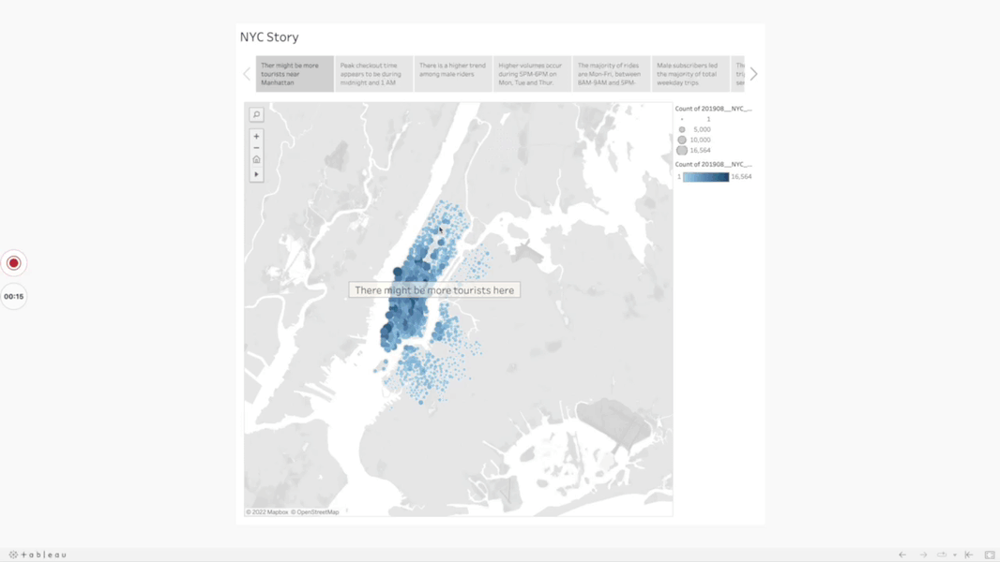
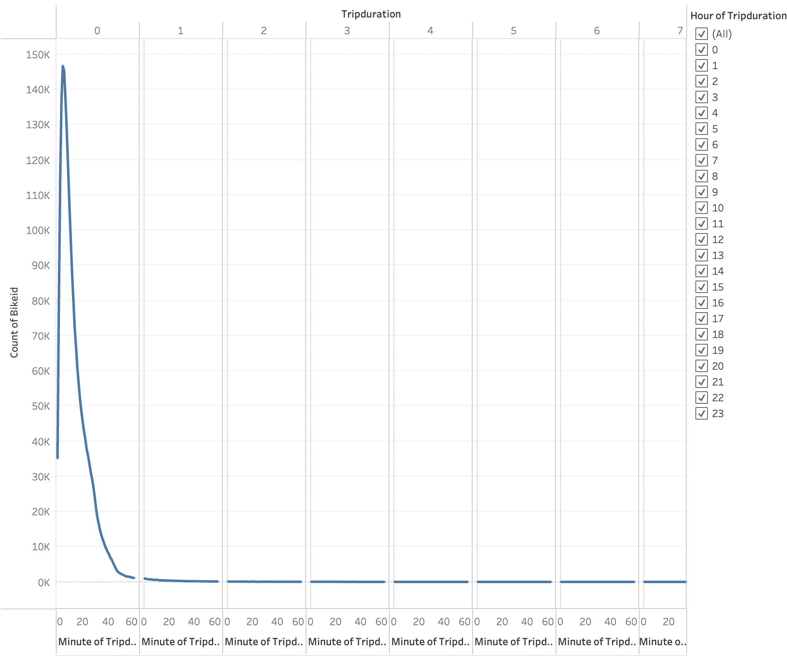
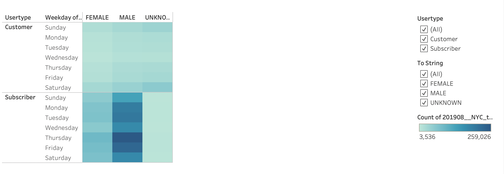
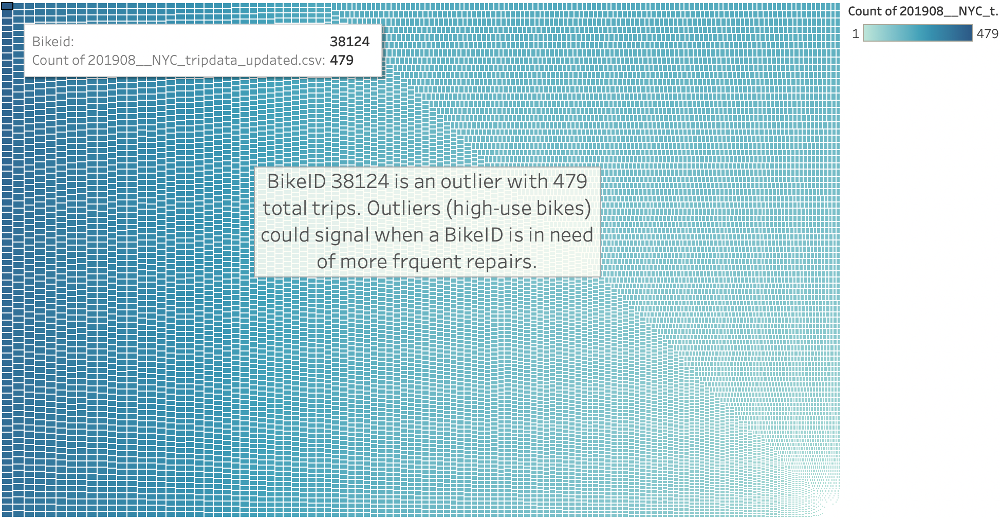
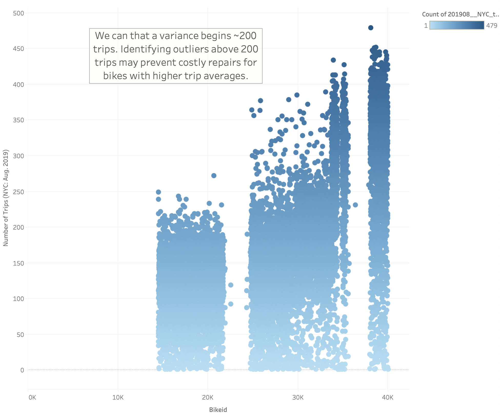

# Citibike Analysis

## Project Overview
This project analyzes bikeshare data from CitiBike in New York City for presentation to investors looking to begin a bikeshare program in Des Moines, Iowa. Using sample citibike data from Newy York, New York, this analysis might help answer a few key questions:
- Who uses bikeshare programs?
- What area of a city sees the most bikeshare usage?
- What time of day are bikes used the most and the least?
- How much are the bikes used and by whom?

Tableau Story
## Resources

Software: [Jupyter Notebook](https://www.anaconda.com/products/individual), [Tableau](https://public.tableau.com/en-us/s/download/thanks) 

Module: Pandas

## Analysis
Tableau Story available [here](https://public.tableau.com/views/CitibikeStory_16641298200300/NYCStory?:language=en-US&publish=yes&:display_count=n&:origin=viz_share_link)

## Results

### Bike trip starting point trends
The data shows that a majority of starting points are concentrated in Manhattan. This could be an indicator of a high-foot traffic area with attractions, which could mean a tourist hub.

### Trip duration by hour
This graphing of number of trips by duration, shows that the vast majority of trips taken on CitiBike bikes are under an hour in length. More specifically, most trips are under a half-hour in length, with a swift dropoff in number of rides over an hour in length.

### Weekday trips by gender and user type
The heat map below states that Male Subscribers are majority-users of the service. The heatmap also displays that those users primarily use the service during 7AM-9AM and 4PM-6PM. This may indicate that the male users are commuting into work.

### Bike repair 
The tiled heatmap shows individual bikeID and usage is displayed by size and shade of the tile. We can see that hige-use bikes are shaded in dark blue, while the average is shaded in teal. Higher volume bikes will need more frequent repairs.

Here is scatter plot showing average use and outliers that could be serviced, due to high-volume use.

## Summary
Citibike bikeshare service appears most popular in busy, densely populated areas. The leading users types are Subscriber and are mostly male. 

Possibly recommendations:

- The current male-dominated Subscriber ration may present an opportunity for outreach to more groups. 
- The main usage seems focused around morning and evening commute times. This could be an opportunity to initiate a bike commuter program to incentivise customer retention.

